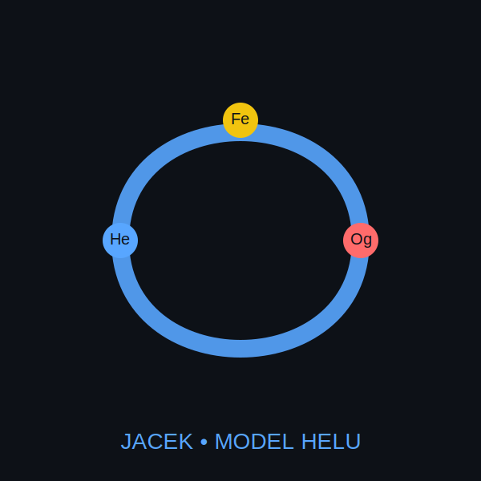

Topologia Informacji to mapa skrętu — model, w którym informacja nie jest zbiorem danych,
lecz procesem. Λ tworzy ramę, τ nadaje kierunek, ρ ujawnia prawdę. 
Jeśli coś jest stabilne, to tylko dlatego, że rezonuje.

<nav style="
    background:#0d1117;
    padding:10px 20px;
    display:flex;
    align-items:center;
    justify-content:space-between;
    border-bottom:2px solid #58a6ff;
">

    <!-- Logo -->
    

        
        
            Λ τ ρ — Topologia Informacji
        
    

    <!-- Linki -->
    

        <a href="index.html" style="color:#fff; margin:0 12px; text-decoration:none;">Strona główna</a>
        <a href="trm.html" style="color:#fff; margin:0 12px; text-decoration:none;">TRM</a>
        <a href="timdr.html" style="color:#fff; margin:0 12px; text-decoration:none;">TIMDR</a>
        <a href="topologia.html" style="color:#fff; margin:0 12px; text-decoration:none;">Topologia</a>
        <a href="zdjecia.html" style="color:#fff; margin:0 12px; text-decoration:none;">Zdjęcia</a>
        <a href="modele.html" style="color:#fff; margin:0 12px; text-decoration:none;">Modele</a>
    

</nav>

# Topologia Informacji – Λ τ ρ

Model rozwijany przez Jacka Stanisława Kielicha, opisujący informację jako proces
oparty na trzech operatorach fundamentalnych:

- **Λ – struktura** (rama możliwych stanów)
- **τ – skręt / transformacja** (kierunek i asymetria procesu)
- **ρ – defekt / niestabilność** (miara błędu modelu)

Całość tworzy spójny system:
**pęd → proces → skręt → relacja → informacja → czas**

---

## 🔷 TRM – Topological Resonance Model
Rezonans skrętu jako warunek stabilnej informacji.  
Stabilność = okresowość τ + kontrolowany ρ + spójna Λ.

Plik: `trm.html`

---

## 🔷 TIMDR – Metryka Czasu i Skrętu
Czas jako ślad stabilnej informacji.  
Metryka mierzy intensywność skrętu, częstotliwość cykli i dynamikę defektu.

Plik: `timdr.html`

---

## 🔷 Topologia Informacji
Główna rama teoretyczna łącząca Λ–τ–ρ w jeden proces.

Plik: `topologia.html`

---

## 🔷 Zdjęcia i wizualizacje
Miejsce na obrazy astronomiczne, struktury skrętu i wizualizacje modeli.

Plik: `zdjecia.html`

---

## 🔷 Modele i repozytoria
Lista projektów, kodów i implementacji.

Plik: `modele.html`

---

## 🔷 Strona
Repozytorium generuje stronę:

**https://jbackk-lang.github.io**

---

## Autor
**Jacek Stanisław Kielich**  
Repozytorium: https://github.com/jbackk-lang
